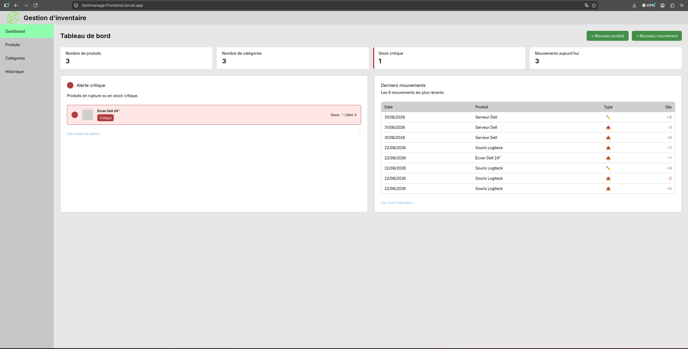
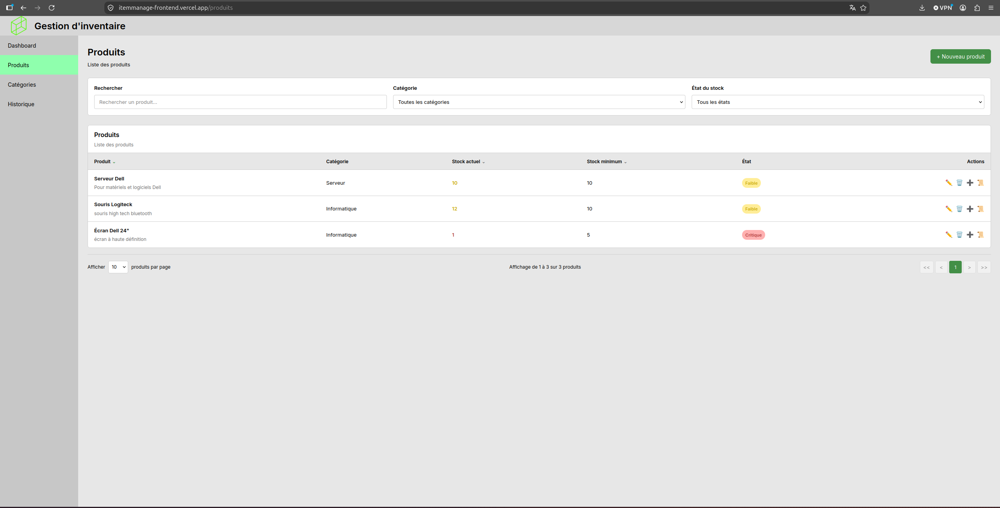
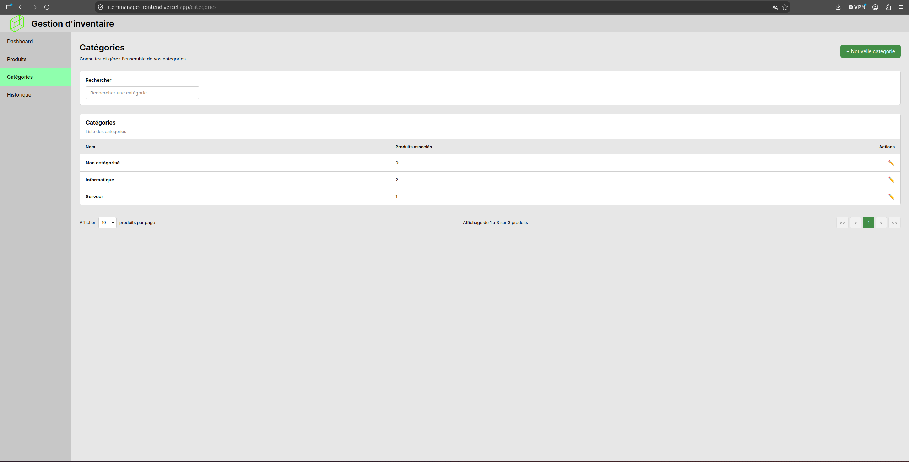
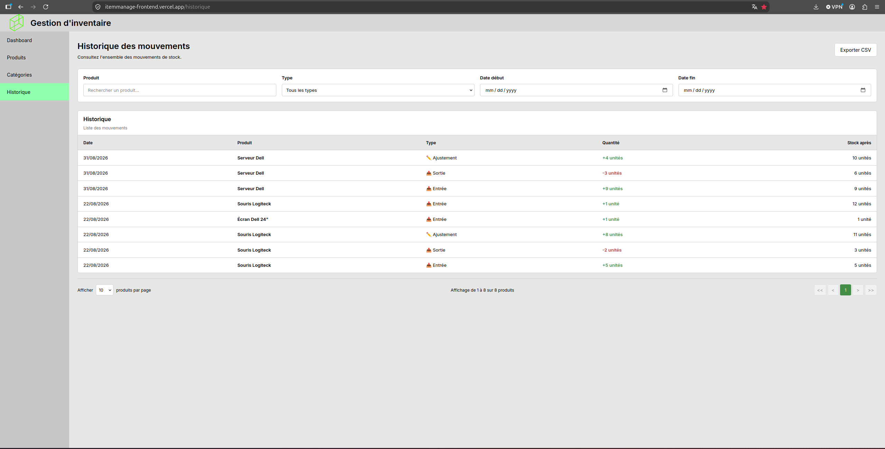
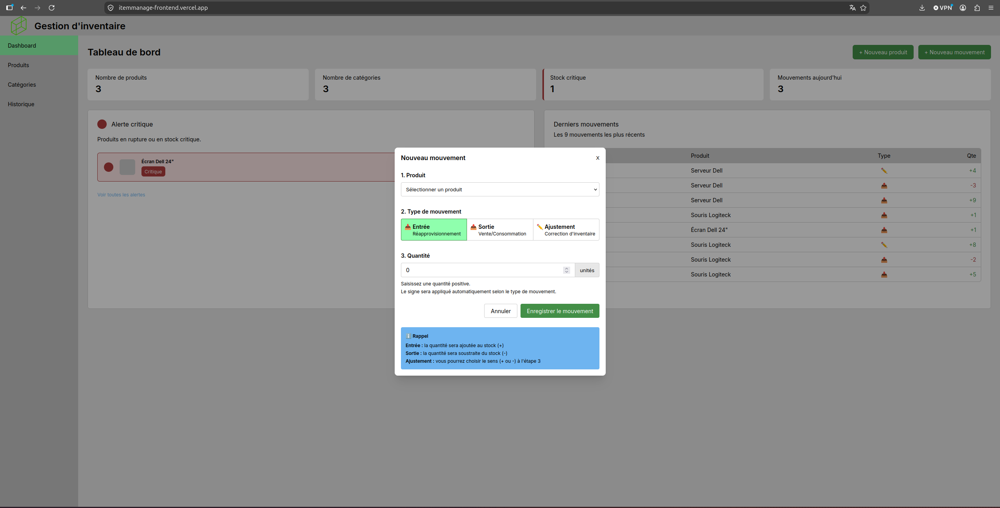
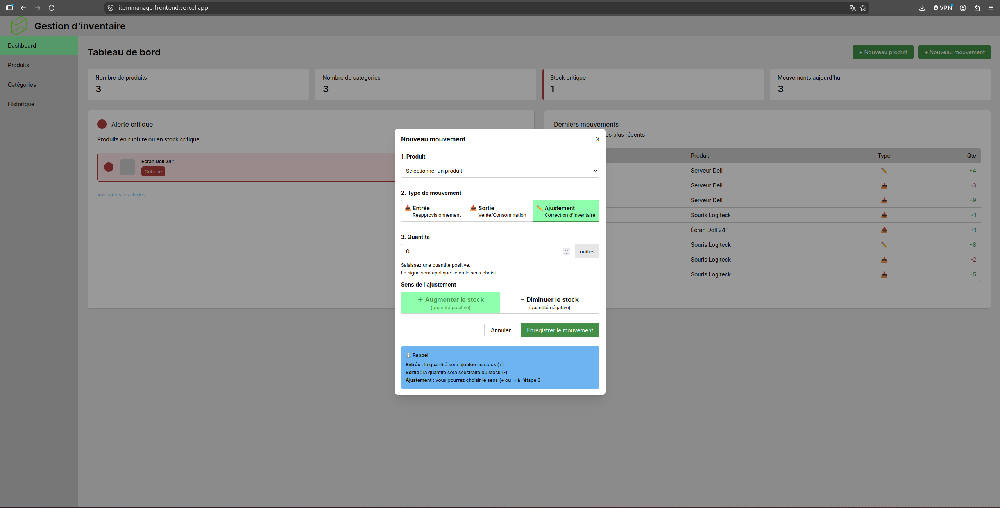

# ItemManage
ItemManage est une application de gestion de stock permettant de centraliser un catalogue de produits, suivre les mouvements d'entrée/sortie et être alerté en temps réel sur les seuils critiques.
Projet personnel réalisé pour approfondir le développement full-stack avec Spring Boot et Vue 3, dans un contexte proche des conditions d'un projet professionnel.

[](https://github.com/Eliess-hue/itemmanageproject/actions/workflows/ci.yml)

🔗 **[Démo en ligne](https://itemmanage-frontend.vercel.app)**

## Fonctionnalités principales
* **Gestion des produits** — rechercher, filtrer et gérer facilement les produits grâce à un CRUD complet et un suivi de leur état de stock.
* **Gestion des catégories** — organiser les produits par catégories et visualiser rapidement le nombre de produits associés à chacune.
* **Suivi des mouvements de stock** — enregistrer les entrées et sorties de stock et consulter leur historique grâce à une recherche filtrée et paginée.
* **Tableau de bord** — disposer d'une vue d'ensemble de l'activité avec les alertes de stock critique, les mouvements du jour et les dernières activités.

## Aperçu

| Dashboard | Produits | Catégories |
|:---:|:---:|:---:|
|  |  |  |

| Historique | Modal mouvement (1) | Modal mouvement (2) |
|:---:|:---:|:---:|
|  |  |  |

## Stack technique
### Backend
* **Java 21**
* **Spring Boot 3.5.1**
* **Spring Data MongoDB**
* **MongoDB**
* **Spring Boot Actuator** — supervision et informations sur l'application
* **Swagger UI / OpenAPI** — documentation et exploration de l'API
* **Testcontainers** — tests d'intégration avec des conteneurs

### Frontend
* **Vue 3**
* **Vite**
* **Vue Router** — navigation entre les différentes vues
* **Reka UI** — composants d'interface accessibles
* **Tailwind CSS** — conception et mise en forme de l'interface

### Infrastructure
* **Docker**
* **Docker Compose**

## Architecture

### Flux applicatif

┌────────────┐       HTTP        ┌─────────────┐       ┌──────────┐
│  Frontend  │ ───────────────→  │   Backend   │ ───→  │ MongoDB  │
│   Vue 3    │ ←───────────────  │ Spring Boot │ ←───  │          │
│  (Vercel)  │                   │  (Render)   │       │  (Atlas) │
└────────────┘                   └─────────────┘       └──────────┘

### Flux de déploiement

┌──────────┐   ┌────────────────┐        ┌──────────────┐
│  GitHub  │ → │ GitHub Actions │ ──┬──→  │    Render    │
└──────────┘   └────────────────┘   │     │   (Backend)  │
                                     │     └──────────────┘
                                     │     ┌──────────────┐
                                     └──→  │    Vercel    │
                                           │  (Frontend)  │
                                           └──────────────┘

## Lancer le projet en local

### Prérequis
* Git
* Docker
* Docker Compose

### Configuration
Copier le fichier d'exemple :
```bash
cp .env.example .env
```

Vérifier ou adapter les variables d'environnement dans `.env` :
```env
ITEM_MONGODB_URI=mongodb://mongo:27017/itemmanage
ITEM_FRONTEND_URL=http://localhost
VITE_API_URL=http://localhost:8080
```

### Démarrage
Depuis la racine du projet :
```bash
docker compose up --build
```

Une fois les conteneurs démarrés :
* Frontend : `http://localhost`
* Backend : `http://localhost:8080`

## Documentation & liens utiles
- 📘 [Documentation API (Swagger)](http://localhost:8080/swagger-ui.html) — une fois le backend lancé
- 📄 [README Backend](itemmanage/README.md)
- 📄 [README Frontend](itemmanage-frontend/README.md)